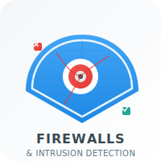

# Firewalls & Intrusion Detection Systems Learning Module

<div align="center">



**Professional Educational Web Application**

*Transforming Complex Cybersecurity Concepts into Interactive Learning Experiences*

[](https://firewalls-ids-web.vercel.app/)
[](LICENSE)
[](package.json)

*Developed by [EOPeak](https://eslam-portfolio-phi.vercel.app/) - Eng. Eslam Osama Saad*

</div>

---

## 📋 Table of Contents

- [🎯 Overview](#-overview)
- [✨ Key Features](#-key-features)
- [🏗️ Architecture](#️-architecture)
- [🛠️ Technology Stack](#️-technology-stack)
- [📚 Educational Content](#-educational-content)
- [🎨 Design System](#-design-system)
- [📄 License & Commercial Use](#-license--commercial-use)
- [📞 Contact & Support](#-contact--support)
- [🙏 Acknowledgments](#-acknowledgments)

---

## 🎯 Overview

**Firewalls & Intrusion Detection Systems Learning Module** is a premium, enterprise-grade educational web application developed by **EOPeak**. This sophisticated single-page application delivers comprehensive cybersecurity education through interactive, visually engaging experiences.

### 🎓 Educational Purpose
Designed for **ECE4304 Data Security** course at AASTMT, this module transforms complex network security concepts into accessible, practical learning experiences for computer engineering students.

### 💼 Commercial Development
This project represents a professional freelancing deliverable under the **EOPeak** brand, demonstrating enterprise-level web development standards and educational technology innovation.

---

## ✨ Key Features

### 🎨 **User Experience**
- **🎯 Interactive Learning**: Progressive disclosure of complex concepts
- **📱 Fully Responsive**: Optimized for desktop, tablet, and mobile devices
- **🌓 Dual Theme System**: Light and dark modes with persistent preferences
- **⚡ Progressive Web App**: Installable, offline-capable experience
- **🎭 Smooth Animations**: Professional micro-interactions and transitions

### 📚 **Educational Features**
- **📖 Segmented Content**: Logical breakdown of security topics
- **🔍 Interactive Navigation**: Sticky navigation with mobile-responsive design
- **📋 Collapsible Sections**: Expandable content cards for detailed information
- **📊 Visual Learning Aids**: Custom diagrams and data visualizations
- **📈 Progress Tracking**: Real-time completion indicators
- **🧠 Review System**: Interactive Q&A for knowledge assessment

### 🛠️ **Technical Capabilities**
- **📸 Content Export**: High-resolution image downloads of sections
- **📦 Bulk Downloads**: ZIP archive generation for complete content
- **🔒 Document Integration**: Original DOCX source linking
- **🌐 Cross-Platform**: Universal browser compatibility
- **♿ Accessibility**: WCAG compliant design standards

## 🏗️ Architecture

### 📁 **Project Structure**
```
firewalls-ids-web-main/
├── 📄 index.html              # Main application entry point
├── 📄 manifest.json           # PWA configuration
├── 📄 sw.js                   # Service worker for offline functionality
├── 📄 browserconfig.xml       # Microsoft tile configuration
├── 📄 robots.txt              # Search engine crawling rules
├── 📄 sitemap.xml             # SEO sitemap
├── 📄 offline.html            # Offline fallback page
├── 📁 assets/                 # Static assets
│   ├── 🖼️ logo.svg           # Main brand logo
│   ├── 🖼️ logo_dark.svg      # Dark mode logo variant
│   ├── 🖼️ favicon.svg        # Browser favicon
│   └── 📄 Sheet10_Firewalls__IDS.docx
└── 📁 media/                  # Educational media assets
    ├── 🖼️ image1.png         # Firewall diagram
    ├── 🖼️ image2.png         # Packet filtering illustration
    ├── 🖼️ image3.png         # Stateful inspection diagram
    ├── 🖼️ image4.png         # Application gateway visualization
    ├── 🖼️ image5.png         # Circuit-level gateway diagram
    ├── 🖼️ image6.png         # DMZ network topology
    └── 🖼️ image7.png         # IDS system architecture
```

### 🔧 **Technical Architecture**

#### **Frontend Architecture**
- **🎨 Component-Based CSS**: Modular styling with custom properties
- **📱 Mobile-First Design**: Responsive breakpoints and fluid layouts
- **🎭 Theme System**: CSS custom properties for dynamic theming
- **⚡ Performance Optimized**: Efficient DOM manipulation and rendering

#### **Progressive Web App**
- **📲 Service Worker**: Advanced caching strategies
- **🔌 Web App Manifest**: Native app-like experience
- **📶 Offline Support**: Graceful degradation and offline content
- **🔄 Background Sync**: Data synchronization capabilities

---

## 🛠️ Technology Stack

### 🎨 **Frontend Technologies**
| Technology | Version | Purpose |
|------------|---------|---------|
| **HTML5** | Latest | Semantic markup and accessibility |
| **CSS3** | Latest | Advanced styling with custom properties |
| **JavaScript** | ES6+ | Interactive functionality and DOM manipulation |
| **SVG** | 1.1+ | Vector graphics and responsive icons |

### 📚 **Libraries & Frameworks**
| Library | Version | Purpose |
|---------|---------|---------|
| **[html2canvas](https://html2canvas.hertzen.com/)** | 1.4.1 | DOM to image conversion |
| **[JSZip](https://stuk.github.io/jszip/)** | 3.10.1 | Client-side ZIP generation |
| **[FileSaver.js](https://github.com/eligrey/FileSaver.js/)** | 2.0.5 | File download functionality |
| **[Font Awesome](https://fontawesome.com/)** | 6.4.0 | Professional icon system |

---

## 📚 Educational Content

### 🎯 **Learning Objectives**
This module comprehensively covers network security fundamentals:

#### **1. Security Objectives** 🔒
- **Confidentiality**: Data protection from unauthorized access
- **Integrity**: Data accuracy and trustworthiness assurance
- **Availability**: System reliability and uptime guarantees
- **Authenticity**: Identity verification and validation
- **Accountability**: Action traceability and audit trails

#### **2. Firewall Fundamentals** 🛡️
- **Purpose & Design Goals**: Network perimeter protection
- **Core Techniques**: Packet filtering and traffic control
- **Architectural Principles**: Defense in depth strategies
- **Limitations & Challenges**: Modern threat landscape considerations

#### **3. Firewall Types** 🔧
- **Packet Filtering Firewalls**: Basic rule-based filtering
- **Stateful Inspection**: Connection state tracking
- **Application-Level Gateway**: Deep packet inspection
- **Circuit-Level Gateway**: Session-based protection

#### **4. DMZ Networks** 🌐
- **Network Segmentation**: Security zone isolation
- **Service Deployment**: Public-facing application hosting
- **Risk Mitigation**: Attack surface reduction
- **Traffic Control**: Inbound/outbound filtering

#### **5. Intrusion Detection Systems** 👁️
- **System Components**: Sensors, analyzers, and interfaces
- **Detection Types**: Host-based vs Network-based systems
- **Detection Methods**: Misuse vs Anomaly-based approaches
- **Alert Management**: Incident response and monitoring

#### **6. Review & Assessment** 📝
- **Knowledge Verification**: Interactive Q&A system
- **Progress Tracking**: Completion status monitoring
- **Self-Assessment**: Learning outcome evaluation

---

## 🎨 Design System

### 🎨 **Color Palette**
```css
:root {
  /* Primary Brand Colors */
  --primary: #00ACC1;
  --secondary: #4DD0E1;
  --accent: #80DEEA;

  /* Neutral Colors */
  --text-main: #00323d;
  --text-secondary: #006978;
  --bg-primary: #FFFFFF;
  --bg-secondary: #F8FCFD;
}
```

### 📐 **Typography Scale**
- **Display**: 2.5rem (40px) - Main headings
- **Heading 1**: 2rem (32px) - Section titles
- **Heading 2**: 1.5rem (24px) - Subsection titles
- **Body Large**: 1.125rem (18px) - Primary content
- **Body**: 1rem (16px) - Standard text
- **Caption**: 0.875rem (14px) - Secondary information

### 📏 **Spacing System**
- **xs**: 0.25rem (4px)
- **sm**: 0.5rem (8px)
- **md**: 1rem (16px)
- **lg**: 1.5rem (24px)
- **xl**: 2rem (32px)
- **xxl**: 3rem (48px)

---

## 📊 Performance

### ⚡ **Core Web Vitals**
- **LCP (Largest Contentful Paint)**: < 2.5s
- **FID (First Input Delay)**: < 100ms
- **CLS (Cumulative Layout Shift)**: < 0.1

### 📈 **Performance Metrics**
- **First Paint**: < 1.2s
- **Time to Interactive**: < 2.0s
- **Bundle Size**: < 500KB (gzipped)
- **Lighthouse Score**: > 95/100

### 🚀 **Optimization Techniques**
- **Code Splitting**: Dynamic imports for libraries
- **Asset Optimization**: WebP images with fallbacks
- **Caching Strategy**: Service worker with stale-while-revalidate
- **Critical CSS**: Above-the-fold content optimization
- **Lazy Loading**: Images and components

---

## 📄 License & Commercial Use

### 💼 **Commercial Licensing**
**© 2025 EOPeak - Eng. Eslam Osama Saad. All Rights Reserved.**

This project is a **commercial deliverable** developed under the **EOPeak** brand. The code, design, and content are protected by intellectual property laws.

#### **Usage Rights**
- **Personal Use**: Educational purposes only
- **Commercial Use**: Requires explicit written permission
- **Modification**: Prohibited without authorization
- **Distribution**: Strictly controlled by license terms

#### **Contact for Licensing**
For commercial licensing inquiries, custom development, or enterprise deployment:

- **Email**: eo6014501@gmail.com
- **Website**: [https://eopeak.com](https://eslam-portfolio-phi.vercel.app/)

### 📜 **Legal Notice**
This software is provided "as is" without warranty of any kind. Unauthorized use, modification, or distribution is strictly prohibited and may result in legal action.

---

## 📞 Contact & Support

### 👨‍💼 **Project Lead**
**Eng. Eslam Osama Saad**
- **Role**: Lead Developer & Founder
- **Company**: EOPeak
- **Email**: eo6014501@gmail.com
- **Website**: [https://eslam-portfolio-phi.vercel.app/](https://eslam-portfolio-phi.vercel.app/)

### 🆘 **Technical Support**
For technical issues, feature requests, or general inquiries:

- **📧 Email**: eo6014501@gmail.com
---

## 🙏 Acknowledgments

### 🎓 **Educational Context**
This project was originally developed for the **ECE4304 Data Security** course at the **Arab Academy for Science, Technology & Maritime Transport (AASTMT)**.

### 👨‍🏫 **Academic Contributors**
- **Course Instructor**: Dr. Mahmoud Yehia
- **Department**: Computer Engineering
- **Institution**: College of Engineering & Technology, AASTMT

### 🏢 **Development Credits**
- **Lead Developer**: Eng. Eslam Osama Saad
- **Brand**: EOPeak
- **Development Year**: 2025
- **Technology Stack**: Modern Web Standards

### 📚 **Resources & Inspiration**
- **Educational Content**: Based on industry-standard cybersecurity curricula
- **Design Inspiration**: Modern educational technology platforms
- **Technical Standards**: Web platform best practices and guidelines

---

## 📈 Project Status

### ✅ **Current Version**: 1.0.0
- **Release Date**: July 2025
- **Status**: Production Ready
- **Maintenance**: Actively Maintained

---

<div align="center">

**Built with ❤️ by [EOPeak](https://eslam-portfolio-phi.vercel.app/)**
**© 2025 Eng. Eslam Osama Saad. All Rights Reserved.**

[](https://eslam-portfolio-phi.vercel.app/)

</div>
